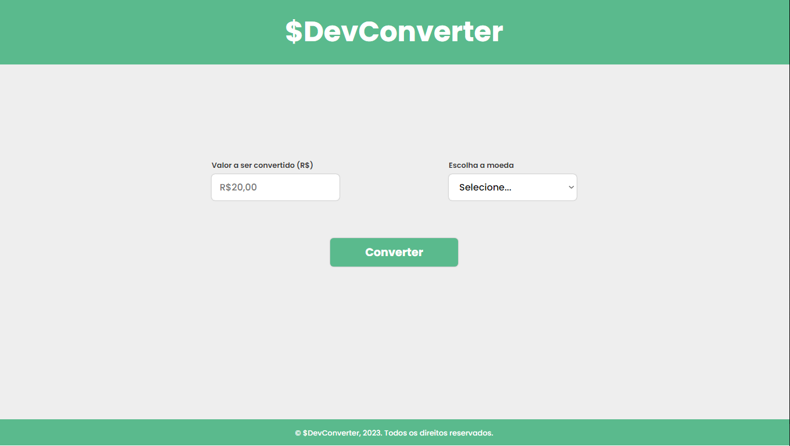

<h1 align="center">DevConverter</h1>

Ajudar você a aperfeiçoar suas habilidades com HTML5, CSS3, Javascript (Utilizaremos apenas essas três tecnologias, sem nenhuma biblioteca ou framework).

  <a href="#-tecnologias">Tecnologias</a>&nbsp;&nbsp;&nbsp;|&nbsp;&nbsp;&nbsp;
  <a href="#-projeto">Projeto</a>&nbsp;&nbsp;&nbsp;|&nbsp;&nbsp;&nbsp;
  <a href="#memo-licença">Licença</a>

  

 

  

## 🚀 Tecnologias

Esse projeto foi desenvolvido com as seguintes tecnologias:

- HTML5 e CSS3
- Git e Github
- Javascript
- Importação de fontes

## 💻 Projeto

Um conversor de moedas, onde você pode verificar o valor do Real em Dólar ou Euro.

## :memo: Licença

Esse projeto está sob a licença MIT.

---

Curso ♥ by Luis Antonio de Souza Silva :wave: [Link do Curso!](https://www.udemy.com/course/html5-css3-e-javascript-na-pratica-3-projetos/)
